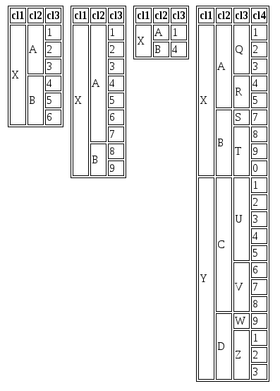

# UsefulTableTree
Esta classe é responsável por transformar uma estrutura de arrays multinível
em uma tabela com os rowspans devidamente setados.

## Particularidade:
A classe funciona para quantos níveis a estrutura de dados possuir, entretanto,
todos os níveis mais distantes da raiz *devem* possuir pelo menos uma folha.

## Atributos da classe
A classe possui dois atributos privados que armazenam os valores passados ao construtor.
$data armazena a estrutura de dados para ser transformada em tabela e $header\_fields
armazena um array contendo os nomes das colunas da tabela.

## Métodos
### __construct
Construtor da classe.

#### Parâmetros
* $data: A estrutura de dados contendo a tabela a ser construída
* $header\_fields: Vetor contendo os nomes das colunas da tabela

### get\_table\_content()
Retorna os dados organizados em três níveis: tbody, tr e td, onde td é um array
no formato ('td' => 'conteúdo'), ou ('td' => 'conteúdo', 'rowspan' => integer)
quando o rowspan precisa ser setado.

### get\_table\_header()
Retorna um array contendo os nomes das colunas da tabela.

### get\_single\_body()
Este método é responsável por gerar um tbody para uma árvore recebida como parâmetro.
Ele primeiro chama $this->queuefy\_body() que transforma a representação em múltiplos
níveis da estrutura da tabela em uma lista, depois define o nível máximo da árvore
recebida e então itera sobre a lista gerada, armazenando o índice atual em $qbody\_index
e construindo a estrutura da tabela.

#### Parâmetros
* $data: Uma subárvore com raiz no primeiro nível de $this->data

### queuefy\_body()
Este método implementa uma busca em profundidade recursiva sobre a estrutura
de dados múltinível recebida por parâmetro e gera um array de arrays associativos
no seguinte formato: ('nível do nó' => 'texto do nó'), ou ('nível do nó' => 'conteúdo', 'rowspan' => 'valor')
quando necessário.

#### Parâmetros
* $data: Uma subárvore com raiz no primeiro nível de $this->data
* &$queue: Array passado por referência que será populado durante a busca pela árvore
* $level: Utilizado para determinar o nível atual e é utilizado como chave para $queue

### max\_level()
Este método retorna o nível mais alto da subárvore transformada em lista por $this->queuefy\_body(),
ele existe para dar independência de número de colunas entre as diferentes subárvores da estrutura
multinível.

#### Parâmetros
* $qbody: O array gerado por $this->queuefy\_body()

### get\_rowspan()
Este método retorna o rowspan correto de cada nível, isto é feito contando o número de
elementos do último nível entre a posição recebida em $index + 1 e a próxima ocorrência
do mesmo nível ($level) em $qbody, ou o final de $qbody.

#### Parâmetros 
* $qbody: O array gerado por $this->queuefy\_body()
* $level: Nível do nó para o qual se está definindo o rowspan
* $index: Posição de $qbody a partir da qual começa o nível que se está definindo o rowspan

